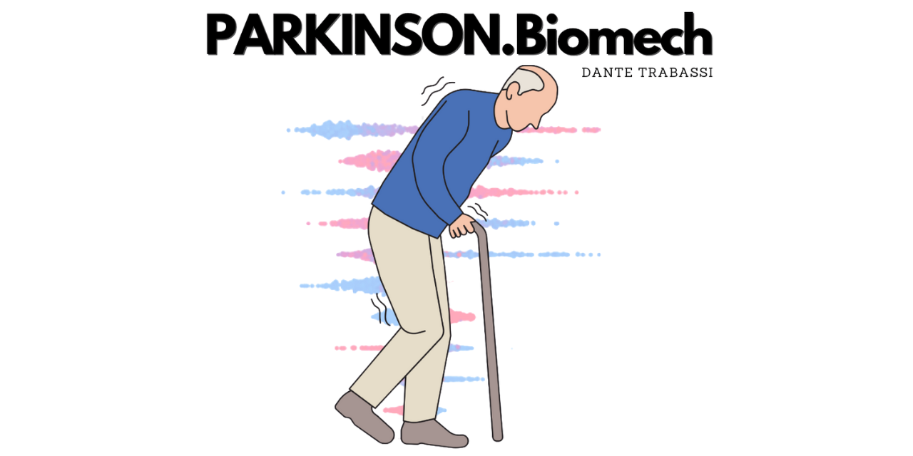

  

# 🧠 ParkinsonBiomech-XAI-GAN  
### *Uncovering Latent Biomechanical Signatures in Parkinson's Gait using Explainable AI and Synthetic Profiling*

---

## 🚀 Project Overview

This flagship project aims to identify, explain, and simulate latent biomechanical phenotypes in Parkinson’s gait using clustering, generative models, and explainable AI. We move beyond classical classification by exploring hidden structures in movement patterns and creating a synthetic simulator to empower clinical research, training, and screening.

---

## 🎯 Clinical and Scientific Objective

To **discover biomechanical phenotypes** in Parkinson's patients, **explain their key features**, and **generate realistic synthetic patient profiles** using ctGAN, with potential applications in:
- Clinical education
- Disease monitoring
- Hypothesis generation
- Anomaly detection in digital gait biomarkers

---

## 🧩 Project Architecture

| **Module**           | **Functionality**                                                                 | **Output**                                         |
|----------------------|------------------------------------------------------------------------------------|----------------------------------------------------|
| `data_prep/`         | Data cleaning, feature selection, imputation, scaling                             | Clean dataset (no identifiers or prodromes)        |
| `cluster_engine/`    | Clustering (KMeans, HDBSCAN, silhouette/PCA/UMAP tuning)                          | 3–6 biomechanical phenotypes                       |
| `xai_explain/`       | SHAP + SHAPSet visualizations per cluster                                         | Signature plots for clinical interpretation        |
| `gan_generator/`     | Cluster-wise ctGAN training                                                       | Realistic synthetic gait profiles                  |
| `anomaly_detector/`  | Outlier scoring for new patients                                                  | Biomechanical anomaly index                        |
| `webapp_predictor/`  | Upload/inject patient → assign cluster → show XAI + simulate via GAN              | Full Streamlit interface for clinical users        |
| `docs/`              | README, clinical guide, case studies, GIFs, deployment tips                       | High-impact public GitHub profile                  |

---

## 💻 Technologies Used

- **Clustering**: KMeans, HDBSCAN, PCA, UMAP  
- **Explainability**: SHAP, SHAPSet plot (`shapiq`), beeswarm, heatmaps  
- **Generative Modeling**: `ctGAN` (via SDV library)  
- **Web Application**: Streamlit *(optionally Django + React)*  
- **Packaging**: Modular Python structure under `src/parkinsonbiomech/`

---

## 🌟 Why This Project Stands Out

| **Dimension**     | **What Makes It Special**                                                  |
|-------------------|------------------------------------------------------------------------------|
| *Innovation*       | Use of GAN to generate biomechanical gait phenotypes                        |
| *Explainability*   | Transparent cluster interpretation via SHAP and SHAPSet                     |
| *Usability*        | Relevant for clinicians, therapists, researchers, students                  |
| *Open Science*     | Fully open-source, modular, cite-ready                                      |
| *Web-Ready*        | Interactive app ready for deployments, interviews, and grants               |
| *Reusability*      | Packaged logic, testable code, and clear separation of concerns             |

---

## 🔧 Immediate Next Steps

- [x] Finalize data cleaning + numeric conversion  
- [ ] Proceed to clustering via `02_clustering.ipynb`  
- [ ] Train ctGAN models per biomechanical cluster  
- [ ] Integrate SHAP explainability for simulated patients  
- [ ] Develop the interactive web interface  

---

## 🧠 Target Audience

- Clinical researchers interested in *biomechanical phenotyping*
- Data scientists working on *interpretable models in healthcare*
- Developers building *medical education tools with synthetic data*
- Students seeking advanced *AI + neuroscience* integration projects

---

## 🤝 Contributing

Open to collaborations! Want to add transfer learning? Test GAN explainability? Deploy with Docker? Get in touch or open a PR.